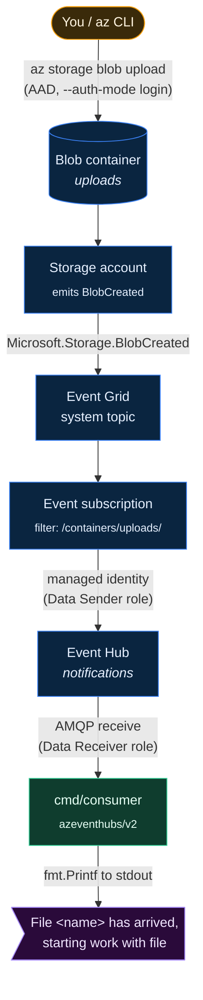
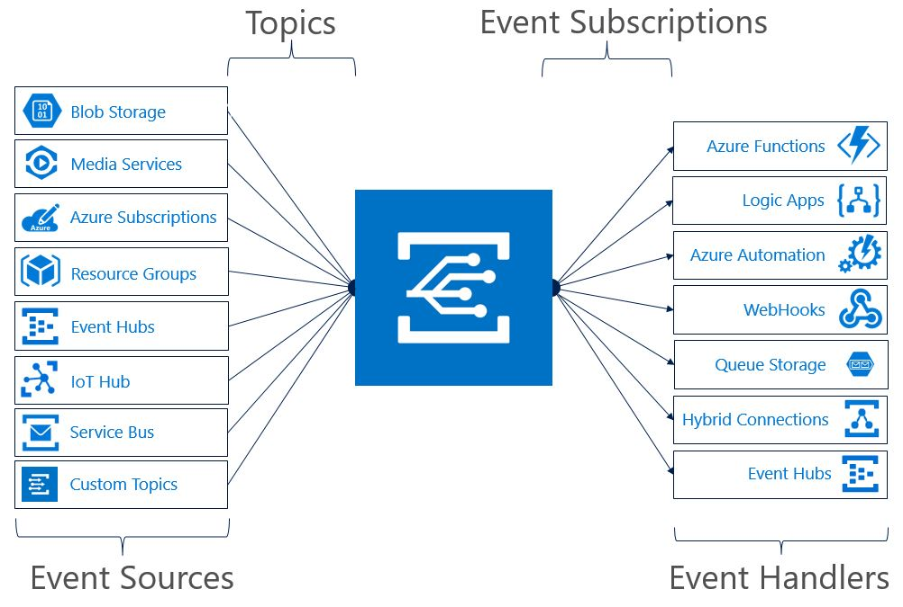

# azure-eventgrid-eventhub-example

A Go example demonstrating the pipeline:



A file dropped into a blob container triggers an Event Grid `BlobCreated`
event, which Event Grid forwards to an Event Hub. The Go consumer in
`cmd/consumer/` reads events from the hub and prints a one-line notice
for every blob that arrives.

NOTE: We don't need to use Event Hub for this example,
there are [other event subscriptions including webooks and 
Azure Funcitons.](https://learn.microsoft.com/en-us/azure/iot-hub/iot-hub-event-grid)



## Layout

```
.
├── go.mod                  # application module
├── cmd/
│   └── consumer/
│       └── main.go         # reads forwarded events from the Event Hub
├── infra/                  # separate Pulumi module
│   ├── go.mod
│   ├── Pulumi.yaml
│   ├── Pulumi.dev.yaml
│   └── main.go
├── scripts/
│   └── dump-env.sh         # writes .env from live Pulumi outputs
├── .env.example            # documents the .env schema (committed)
├── .env                    # actual values (gitignored, generated)
├── cli-example.md          # manual walkthrough with az + portal
└── README.md
```

The infra module is fully separate so the application module does not
pull in Pulumi's dependency tree.

## Prerequisites

- An Azure subscription (personal is fine).
- [Azure CLI](https://learn.microsoft.com/en-us/cli/azure/install-azure-cli)
  logged in: `az login`. The signed-in principal is granted the
  `Event Hubs Data Receiver` and `Storage Blob Data Contributor` roles
  by Pulumi so the application can consume from Event Hub and upload
  test blobs.
- [Pulumi CLI](https://www.pulumi.com/docs/install/).
- Go 1.26+.

## Deploy

```bash
cd infra
pulumi stack init dev          # first time only
pulumi up
```

Outputs:

| Output                    | What it is                                              |
|---------------------------|---------------------------------------------------------|
| `resourceGroupName`       | Resource group containing everything                    |
| `storageAccountName`      | Name of the storage account                             |
| `containerName`           | The blob container that events are filtered to          |
| `eventHubNamespaceFqdn`   | `<namespace>.servicebus.windows.net` (AAD-friendly)     |
| `eventHubName`            | Name of the Event Hub that receives events              |

The application reads these via `pulumi stack output <name>` or by
querying Azure directly.

## Environment variables (`.env`)

Application code and the Azure Go SDK samples linked in this repo
expect a handful of env vars (`AZURE_SUBSCRIPTION_ID`, the resource
names, etc.). The schema is in `.env.example` (committed). A real
`.env` (gitignored) is generated from the live Pulumi outputs and
your current `az account`:

```bash
./scripts/dump-env.sh
```

Re-run it after any `pulumi up` that changes outputs.

### Passphrase

The stack uses Pulumi's passphrase secrets provider, so reading any
output requires `PULUMI_CONFIG_PASSPHRASE` to be set even though our
outputs are not themselves secrets. Easiest path: put your passphrase
in `.env` once (the script reads it from the shell, so the first run
needs it exported manually):

```bash
export PULUMI_CONFIG_PASSPHRASE="<your passphrase>"
./scripts/dump-env.sh
# now edit .env and add the passphrase line so future shells can just source it
```

If you didn't set a passphrase at `pulumi stack init`, use an empty
string (`export PULUMI_CONFIG_PASSPHRASE=""`).

### Loading `.env` into your shell or app

Pick one. The first option is the simplest and adds zero dependencies:

```bash
# A) Source for the current shell — recommended for this project
set -a; source .env; set +a
go run ./...

# B) direnv — auto-loads when you cd in. Needs direnv installed.
#    echo "dotenv" > .envrc && direnv allow

# C) godotenv in Go code — app loads .env itself.
#    import _ "github.com/joho/godotenv/autoload"
```

`.env` is gitignored. Do **not** commit it — it contains your
passphrase and (depending on your setup) other things you don't want
in source control.

## Run and test the pipeline

End-to-end smoke test: start the consumer in one terminal, upload a blob
from another, watch the consumer print the notice.

**Terminal A — start the consumer.**

```bash
set -a; source .env; set +a
go run ./cmd/consumer
```

You should see startup logs (`starting consumer ... partitions=[0]`,
`partition ready partition=0`) and then quiet. The consumer reads from
the `Latest` position of each partition, so events from *before* it
started are not replayed; only blobs uploaded while it is running will
show up.

**Terminal B — trigger an event.**

```bash
set -a; source .env; set +a

echo "hello $(date -Is)" > /tmp/hello.txt
az storage blob upload \
  --account-name "$STORAGE_ACCOUNT_NAME" \
  --container-name "$BLOB_CONTAINER_NAME" \
  --name "hello-$(date +%s).txt" \
  --file /tmp/hello.txt \
  --auth-mode login
```

Within a few seconds, Terminal A prints:

```
File hello-1747120800.txt has arrived, starting work with file
```

`Ctrl+C` in Terminal A shuts the consumer down cleanly via
`signal.NotifyContext` — partition clients drain and close on their own.

**Notes on the consumer design.**

- One goroutine per partition, coordinated by
  `golang.org/x/sync/errgroup`. We provisioned a single-partition hub,
  so it's one goroutine in practice; the pattern fans out unchanged if
  you ever bump partition count.
- Auth is `azidentity.NewDefaultAzureCredential` — same path the
  README's Auth model section describes. No connection strings or
  account keys.
- The consumer is **stateless**: no checkpoint store. Each run starts
  from `Latest`. For production multi-instance coordination you'd swap
  `ConsumerClient` for `Processor` + a blob-backed checkpoint store,
  but that's a larger sample than this one is trying to be.
- Operational logs go to stderr via `log/slog`; the
  `File ... has arrived` notice goes to stdout via `fmt.Printf`, so you
  can pipe the two streams separately if needed.

## Running in CI/CD

`.env` is for local development only. In CI, inject the same variables
via the platform's secrets store; never generate or commit `.env`.

### Azure authentication

`DefaultAzureCredential` is the same library in CI as it is locally —
it just looks at different env vars. Prefer **OIDC federation** over
storing a client secret.

- **GitHub Actions**: create a federated credential on a service
  principal (or user-assigned managed identity) in Entra ID, then use
  [`azure/login@v2`](https://github.com/Azure/login) with `client-id`,
  `tenant-id`, `subscription-id`, and `enable-AzPSSession: false`.
  After it runs, subsequent steps' Go code can call
  `azidentity.NewDefaultAzureCredential` with no further env setup.
- **Azure DevOps**: use the [AzureCLI@2 task](https://learn.microsoft.com/en-us/azure/devops/pipelines/tasks/reference/azure-cli-v2)
  with workload-identity federation — same effect.
- **GitLab CI**: use the [`id_tokens`](https://docs.gitlab.com/ee/ci/yaml/#id_tokens)
  keyword to issue an OIDC JWT, write it to a file, and point
  `AZURE_FEDERATED_TOKEN_FILE` at that path. On the Azure side,
  configure a federated credential on a service principal in Entra ID
  whose issuer is GitLab (`https://gitlab.com` for SaaS, or your
  self-hosted instance URL) and whose subject matches your project /
  branch / environment. Then in `.gitlab-ci.yml`:

  ```yaml
  deploy:
    id_tokens:
      AZURE_ID_TOKEN:
        aud: api://AzureADTokenExchange
    variables:
      AZURE_CLIENT_ID: $AZURE_CLIENT_ID            # set as masked CI/CD vars
      AZURE_TENANT_ID: $AZURE_TENANT_ID
      AZURE_SUBSCRIPTION_ID: $AZURE_SUBSCRIPTION_ID
    script:
      - export AZURE_FEDERATED_TOKEN_FILE=$(mktemp)
      - printf '%s' "$AZURE_ID_TOKEN" > "$AZURE_FEDERATED_TOKEN_FILE"
      - go run ./...
  ```

  `DefaultAzureCredential` discovers `AZURE_FEDERATED_TOKEN_FILE` and
  authenticates via workload identity — no client secret needed. The
  same job can run `pulumi up`; just also expose
  `PULUMI_CONFIG_PASSPHRASE` (and `PULUMI_ACCESS_TOKEN` if using
  Pulumi Cloud) as masked variables.
- **Other CI**: set `AZURE_TENANT_ID`, `AZURE_CLIENT_ID`, and either
  `AZURE_FEDERATED_TOKEN_FILE` (workload identity, preferred) or
  `AZURE_CLIENT_SECRET` (last resort). `DefaultAzureCredential` reads
  these automatically.

### Non-secret app vars

The Pulumi outputs (`AZURE_RESOURCE_GROUP`, `EVENT_HUB_NAMESPACE_FQDN`,
etc.) can be supplied two ways in CI:

- **Static**: hardcode them in the workflow (or in
  `vars.<NAME>` GitHub Action variables). Fine if the stack is
  long-lived and shared across runs.
- **Dynamic from Pulumi**: a job step that runs `pulumi stack output
  --json` and exposes each value to subsequent steps via
  `$GITHUB_OUTPUT`. This is the cleaner pattern if the stack is the
  source of truth.

### Pulumi in CI

If `pulumi up` itself runs from CI:

- The Pulumi backend needs credentials too — `PULUMI_ACCESS_TOKEN` for
  Pulumi Cloud, or an Azure storage credential / similar for a
  self-hosted backend.
- `PULUMI_CONFIG_PASSPHRASE` (or `PULUMI_CONFIG_PASSPHRASE_FILE`) must
  be set in the runner. For the passphrase provider, store it in your
  CI secrets store; do not put it in the workflow file.
- For zero interactivity, pass `--yes` and `--non-interactive` to
  `pulumi up`.

## Auth model

No keys or connection strings are used anywhere:

- **Event Grid -> Event Hub**: the Event Grid system topic has a
  system-assigned managed identity, which is granted
  `Azure Event Hubs Data Sender` on the hub.
- **App -> Event Hub / Storage**: the signed-in user is granted
  `Azure Event Hubs Data Receiver` on the hub and
  `Storage Blob Data Contributor` on the storage account. The Go app
  uses `azidentity.DefaultAzureCredential`, which picks up your
  `az login` session automatically.

## Tear down

```bash
cd infra
pulumi destroy
pulumi stack rm dev
```
